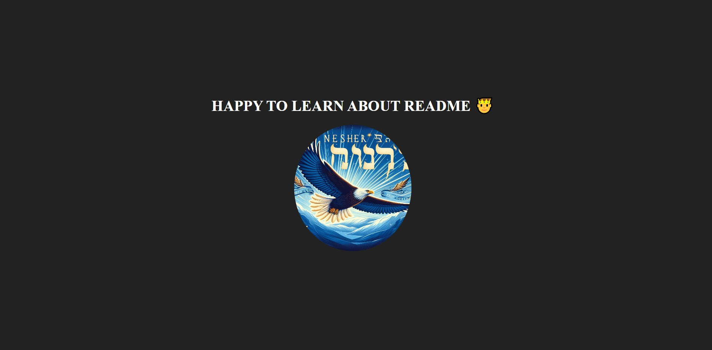

#  A SIMPLE WEBSITE ABOUT MY PROFILE 🤴

## A simple website showcasing my profile as a developer 🖥️


 Lorem ipsum dolor sit amet consectetur, adipisicing elit. Ullam blanditiis ut cupiditate, consequatur hic dolore veniam, iste tenetur voluptas harum qui fugiat dolor vel molestias totam maiores inventore fuga beatae maxime repudiandae. Asperiores, accusamus reiciendis?

 ## How to run this project <mark>**locally** </mark>😍

 this is a __bold__ text

 this text is *italic*

 This project is like H<sub>2</sub>O in Chemistry, you cannot do without it and growing like The function e<sup>x</sup> in mathematics

 Please i want you to edit the footer but not the ~~navbar~~
```js
 const x=4
 const y=3
 console.log(x+y)
 ```

 ## PYTHON CODE NOW
 ```python
 def calculate(x, y):
    return x + y
 ```

 ## CONTRIBUTIONS

 This project is about an online language teaching website which needs some contributions in the sections which will be listed below

 - About page
 - Side bar
 - Contact page
 
 The **navbar** and the home landing page don't need any further modification

 <mark>About page</mark>


Lorem ipsum dolor sit amet consectetur, adipisicing elit. Ullam blanditiis ut cupiditate, consequatur hic dolore veniam, iste tenetur voluptas ~~Navbar~~ fugiat dolor vel

<mark>Side Bar</mark>


Lorem ipsum dolor sit amet consectetur, adipisicing elit. Ullam blanditiis ut cupiditate, consequatur hic dolore veniam, iste tenetur voluptas ~~Navbar~~ fugiat dolor vel

<mark>Contact page</mark>


Lorem ipsum dolor sit amet consectetur, adipisicing elit. Ullam blanditiis ut cupiditate, consequatur hic dolore veniam, iste tenetur voluptas ~~Navbar~~ fugiat dolor vel

## Find me 😎
[linkedIn](http://linkedIn.com)


[Instagram](http://linkedIn.com)


[Twitter](http://linkedIn.com)

## Project Screenshot

